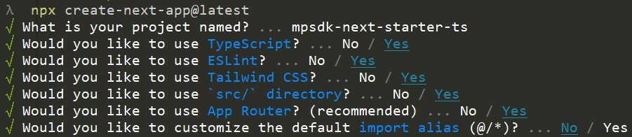

# Matterport SDK Next.js Starter

This is an attempt to create a Next.js starter that shows how to integrate both the [Matterport WebComponent](https://www.npmjs.com/package/@matterport/webcomponent) and [@matterport/sdk](https://www.npmjs.com/package/@matterport/sdk).

The WebComponent is loaded dynamically as our NPM Package is not compatible with server side rendering.

Upon installing, the latest version of our matterport-assets will automatically run - this is helpful for use within code sandbox environments.

## Base Next.js project
The Base Next.js project is a [Next.js](https://nextjs.org/) project bootstrapped with [`create-next-app`](https://github.com/vercel/next.js/tree/canary/packages/create-next-app).


### Install

```bash
yarn install
```

### Run

```bash
yarn dev
```

Open [http://localhost:3081](http://localhost:3081) with your browser to see the result.
